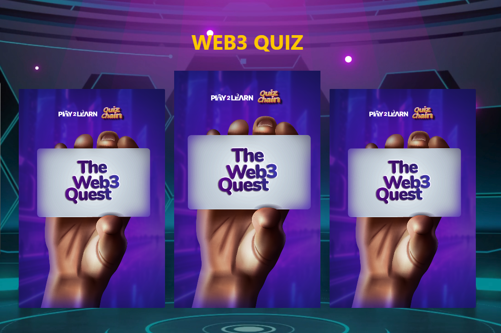

# P2L - Play2Learn  

  

P2L (Play2Learn) is an innovative Web3 educational platform that gamifies learning about cryptocurrency and blockchain technology. Through interactive quizzes and challenges, users can earn tokens, connect with a community of learners, and deepen their understanding of Web3 concepts—all while having fun!  

## Table of Contents  
- [P2L - Play2Learn](#p2l---play2learn)
  - [Table of Contents](#table-of-contents)
  - [Features](#features)
  - [Benefits](#benefits)
  - [Tech Stack](#tech-stack)
  - [Installation](#installation)
    - [Prerequisites](#prerequisites)
    - [Steps](#steps)
  - [Usage](#usage)
  - [Contact](#contact)
    - [Happy learning, and welcome to the world of Web3 with P2L!](#happy-learning-and-welcome-to-the-world-of-web3-with-p2l)
   
 

## Features  
- **Interactive Quiz Game:** Test your Web3 knowledge with a card-based quiz system featuring real-time feedback and scoring.  
- **Wallet Integration:** Seamlessly connect your Universal Profile or Ethereum wallet (e.g., LUKSO Testnet) using EIP-6963 provider detection.  
- **Responsive Design:** Fully responsive UI that works across desktop, tablet, and mobile devices.  
- **Score Tracking:** Earn points for correct answers and review your performance with detailed feedback on correct and incorrect responses.  
- **Community Engagement:** Connect with fellow Web3 enthusiasts and learners.  

## Benefits  
Unlock these awesome benefits by joining P2L:  
- **Learn Crypto & Web3:** Master blockchain concepts through engaging, interactive games.  
- **Build Connections:** Network with a community of like-minded learners and Web3 enthusiasts.  
- **Earn Rewards:** Collect tokens and badges as you complete challenges and quizzes.  

## Tech Stack  
- **Frontend:** React, TypeScript  
- **Blockchain Integration:** Ethers.js, EIP-6963 Wallet Provider  
- **Styling:** Tailwind CSS (inferred from class names), Custom CSS  
- **Routing:** React Router  
- **Context API:** React Context for wallet state management  
- **Assets:** Custom images for cards and backgrounds  

## Installation  
Follow these steps to set up the project locally:  

### Prerequisites  
- Node.js (v16 or higher)  
- npm or yarn  
- A Web3 wallet (e.g., Universal Profile Browser Extension or MetaMask) for testing wallet integration  
- LUKSO Testnet (Chain ID: 4021) configured in your wallet (optional)  

### Steps  
1. **Clone the Repository:**  
    ```bash  
    git clone https://github.com/your-username/p2l.git  
    cd p2l  
    ```  

2. **Install Dependencies:**  
    ```bash  
    npm install  
    ```  
    or  
    ```bash  
    yarn install  
    ```  

3. **Run the Development Server:**  
    ```bash  
    npm start  
    ```  
    or  
    ```bash  
    yarn start  
    ```  

4. **Open the App:**  
   Open your browser and navigate to [http://localhost:3000](http://localhost:3000).  

## Usage  
- **Connect Your Wallet:**  
  On the homepage or quiz page, click "Connect Wallet" to link your Universal Profile or Ethereum wallet. Ensure you're on the LUKSO Testnet (Chain ID: 4021) for full functionality.  

- **Play the Quiz:**  
  Start the quiz game and answer Web3-related questions. Earn 100 points for each correct answer. Review your score and missed questions when the timer runs out.  

- **Explore Benefits:**  
  Check out the benefits section to see what you can gain by participating.  

- **Disconnect:**  
  Click "Disconnect" in the header to unlink your wallet.  

## Contact

Have questions or suggestions? Reach out to us:  

- **Email:** [your-email@example.com](mailto:your-email@example.com)  
- **Twitter:** [@YourTwitterHandle](https://twitter.com/YourTwitterHandle)  
- **Discord:** [Join our community here](your-discord-invite-link)  

### Happy learning, and welcome to the world of Web3 with P2L! 

